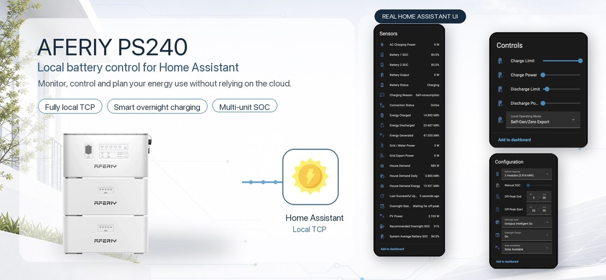
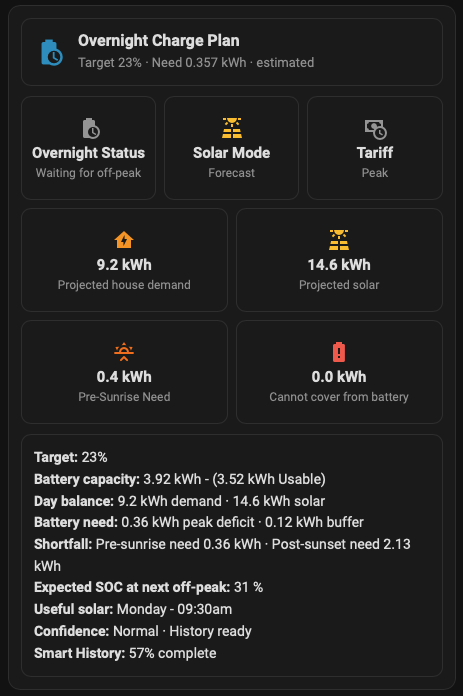

# AFERIY PS240 (Local)

Home Assistant custom integration for local TCP monitoring and control of an AFERIY PS240.

This is a cleaned-up, AFERIY-focused fork of the AECC local TCP integration. It keeps the original `aecc_battery` integration domain so existing entities, dashboards, and automations do not need to be renamed.

## Features

- Local TCP connection to the battery, usually on port `8080`
- Battery state of charge, power, PV, charge, discharge, and diagnostic sensors
- Manual charge, discharge, idle, and self-consumption controls
- Experimental Feed mode with a passive Base Feed Power target
- Local-first automatic overnight charging with smart or manual SOC targets
- Charge and discharge SOC limits
- Charge/discharge power targets from 800 W to 1200 W for cautious PS240 testing
- PV surplus charge trigger for systems with unmanaged microinverters
- Physics-aware filtering for occasional invalid SOC/power readings
- Home Assistant diagnostics export support
- Custom AFERIY PS240 icon
- Bundled AFERIY Overnight Plan dashboard card
- Connection health and last-command result sensors
- Grid meter agreement and charging reason diagnostics

## Install With HACS

1. Open HACS in Home Assistant.
2. Go to Integrations.
3. Open the three-dot menu and choose Custom repositories.
4. Add this repository URL as an Integration.
5. Search for `AFERIY PS240 (Local)` and install it.
6. Restart Home Assistant.

## Manual Install

Copy `custom_components/aecc_battery` into your Home Assistant `config/custom_components/` folder, then restart Home Assistant.

## Configuration

1. In Home Assistant, go to Settings > Devices & services.
2. Choose Add integration.
3. Search for `AFERIY PS240 (Local)`.
4. Enter the battery's local IP address, TCP port, and display name.

Use a static IP address or DHCP reservation for the battery so Home Assistant can always find it.

### Multiple PS240 Units

If you have more than one PS240 in the same AFERIY/AEC Cloud system, add only the master unit to this integration.

The master controls the slave units. You do not need a separate local integration entry for each battery. In testing, one local connection to the master has been more reliable than trying to connect to every unit.

System-level readings are reported through the master. System Average Battery SOC is the main multi-unit SOC source and matches the behaviour shown in the AEC Cloud app.

The integration creates generic `Battery 1 SOC`, `Battery 2 SOC`, and similar entities from the local `Storage_list` entries reported by the master. This avoids tying dashboards to a particular serial number when a unit is replaced.

After adding, removing, or replacing a battery/inverter, restart Home Assistant or reload the integration so the individual battery entity list is rebuilt from the master. The Battery Capacity preset does not control battery identification.

## Options

Open the integration options to adjust:

- Polling interval
- Advanced energy estimate sensors
- Off-peak tariff preset
- Off-peak start and end times
- External helper confirmations for advanced estimates

The device Configuration section also provides Overnight Charge mode, Manual SOC, Off-Peak Tariff, Off-Peak Start/End, Solar Availability, Overnight Status, and Recommended Overnight SOC. Battery Capacity is available when Advanced Energy Estimate Sensors is enabled.

The advanced estimate sensors are disabled by default because they can depend on external Home Assistant entities such as grid meters, solar forecast data, or household demand history.

Battery Capacity is an advanced estimate input selected in 1.958 kWh module steps. It is used by the charge and overnight energy calculations only. It does not limit the Battery N SOC sensors reported by the master.

The off-peak window defaults to Intelligent Octopus Go, 23:30 to 05:30.
Named presets are available for Snug Octopus, Intelligent Octopus Go,
Octopus Go, EDF GoElectric 35, British Gas EV Power+, E.ON Next Drive,
British Gas Standard E7, EDF E7 Fixed, OVO Simpler Energy E7, Octopus E7,
and E.ON Next Pumped Fixed. If your tariff uses different cheap-rate hours,
choose Custom and set the start and end times manually in 24-hour `HH:MM`
format. These times are used by the overnight target and Pre-Sunrise Need
calculations.

The external helper checkboxes are reminders for installers. They do not install or validate integrations. Smart estimates look for standard Solcast forecast files and sensors and use `zone.home` for home occupancy. Battery control and the overnight target use the configured tariff window and AECC grid reading; Shelly comparison remains diagnostic only.

### Smart Overnight Charging

Automatic Overnight Charging is designed for homes with a cheap overnight
tariff. The aim is simple: charge enough overnight to avoid expensive daytime
import, but leave room for free solar the next day.

It runs locally through the PS240 TCP connection. No Octopus or cloud trigger is
required.

- **On** uses the calculated Recommended Overnight SOC.
- **Manual** uses the Manual SOC slider.
- **Off** leaves overnight charging disabled.
- Starts one minute after the configured off-peak start time.
- Watches System Average Battery SOC during the cheap-rate window.
- Starts charging if SOC falls to or below the target.
- Holds/pauses once the target is reached.
- Re-checks the SMART target during off-peak and may raise the locked target if
  the live recommendation has increased materially. It does not lower the locked
  target mid-window, so the system avoids twitchy behaviour and can still carry
  useful cheap-rate energy forward on low-solar days.
- Restores Self-Gen/Zero Export five minutes before off-peak ends, because the
  PS240 can take a few minutes to move cleanly from grid charging back to normal
  battery behaviour.

Recommended Overnight SOC is calculated from:

- **Battery capacity** and the configured minimum discharge SOC, so unusable
  reserve is not counted as available energy.
- **House demand history**, using a weighted 30-day time-of-day profile from
  Home Assistant Recorder. The latest 14 valid occupied days receive the
  strongest weighting, while older days provide lighter fallback coverage so a
  two-week holiday does not make the house appear permanently empty. Retain at
  least 35 days in Recorder so the complete 30-day profile remains available.
- **Normal occupied-house use**, with `zone.home` used to avoid treating
  empty-house days as normal demand.
- **Tomorrow's Solcast forecast**, preferably the timed forecast file rather
  than yesterday's clipped production.
- **Whole-day balance**, comparing expected house demand with expected solar
  before the next off-peak window.
- **Pre-Sunrise Need**, covering the period after off-peak ends and before solar
  is expected to be useful.
- **Post-Sunset Need**, keeping enough reserve after useful solar falls away to
  reach the next cheap-rate window.
- **AFERIY AC charging**, which is subtracted from demand history so overnight
  grid charging is not counted as normal house use.
- **A small buffer and confidence adjustment**, so stale forecast data or weak
  demand history makes the target safer rather than optimistic.

Two optional SMART tuning sliders are available under Configuration:

- **SMART Solar Forecast** lets you gently scale the Solcast forecast up or down
  if your real system consistently produces more or less than Solcast expects.
- **SMART House Demand** lets you gently scale the house demand estimate up or
  down if the recommendation is consistently too cautious or too light.

House Demand automatically includes additional live solar-power sources added
to Home Assistant's **Energy Dashboard**. This is useful when the AFERIY system
shares the property with another inverter, such as Hoymiles. Add that inverter's
solar energy and live power entities under **Settings > Dashboards > Energy >
Solar Panels**. The integration excludes its own AFERIY PV entity, adds the
other configured solar power to the demand calculation, and requires no extra
AECC setting.

Leave both at 100% to use the normal calculation. On low-solar or close-call
days, the planner may deliberately charge more overnight so cheap-rate energy is
carried forward, while still leaving enough battery space for the solar that is
forecast to arrive.

The integration also includes a **Solar Availability** dropdown. Set it to Solar
Unavailable when panels are covered, disconnected, or otherwise unable to
generate. The overnight calculation will then treat the solar forecast as 0 kWh
and show Batteries Only status.

#### Important Solcast Setup

When setting up Solcast, **do not set the AC inverter output to 800 W per unit**.

The batteries are capable of charging much faster than this and are rated to
**2.4 kW**.

If this is set too low, Solcast can under-estimate solar production. That can
make the overnight recommendation too high and charge the batteries more than
needed.

### Dashboard Card

The integration includes a bundled **AFERIY Overnight Plan** Lovelace card that
shows the smart overnight target, battery capacity, demand versus solar balance,
Pre-Sunrise Need, Post-Sunset Need, useful solar time, forecast confidence, and
SMART History completeness. It also shows expected reserve before the next
off-peak window and any SMART forecast/demand tuning that has been applied.

To make it available in Home Assistant's card picker:

1. Restart Home Assistant after installing or updating the integration.
2. Add dashboard resource `/aecc_battery_static/aferiy-overnight-plan-card.js`
   as a JavaScript module.
3. Edit a dashboard, choose Add card, switch to By card, and search for
   `AFERIY Overnight Plan`.

See [Dashboard Card](docs/dashboard-card.md) for manual YAML and optional entity
overrides.

Local schedule-slot registers mirrored from the AEC Cloud app were tested and
behaved as immediate commands on the PS240, so they are not exposed as normal
controls. The integration-owned scheduler instead performs the timing in Home
Assistant and sends the same proven local Charge, Idle, and Self-Gen commands.

### Solar Clipping And Export

The PS240 can clip or hold back surplus PV when the battery is full or when the system is running in zero-feed behaviour.

Bypassing this PV clipping has been possible in testing, but the mode switching became unreliable. The current self-consumption switching is deliberately conservative because it reliably returns the battery to a safe local operating mode after charging or idling.

At the moment, bypassing clipping/export reliably is not supported by this integration. It may become possible in the future, but it may also need a firmware or app/API update from AFERIY before it can be made stable.

### PV Surplus Charge Trigger

This setting is useful when the AFERIY system shares the same electrical system
with an unmanaged micro-inverter or another PV source that it does not directly
control.

As soon as your Smart Meter (usually Shelly) sees that you are exporting more than your set value
between `0 W` and `50 W`, it tells your home batteries to ramp up and start
charging from the extra energy.

Having a small buffer gives the system a stable threshold to trigger clean,
sustained battery charging without constantly hunting or "chattering" around
zero.

### Experimental Feed Mode

Feed mode is experimental. It is intended for users who want the battery to
provide a base grid-connected output, especially where there is no smart
meter/CT feedback available for normal zero-feed control.

The **Base Feed Power** slider is passive. Moving the slider only stores the
target value in Home Assistant. Nothing is sent to the battery until you select
**Feed** from the Operating Mode dropdown.

When Feed is selected, the integration writes the local base feed/discharge
register discovered from the AEC Cloud app's **Battery base grid-connected
power** setting.

This is not the same as the normal Discharge mode:

- Discharge uses a manual schedule slot and takes over the battery.
- Feed stays closer to the EMS/grid-connected behaviour and applies a base
  feed target.
- Actual output may be higher or lower than the slider value.
- On systems with a smart meter or CT clamp, the EMS may adjust output while it
  continues managing grid flow.
- On systems without smart meter feedback, it may behave more like a fixed
  discharge target.

To stop Feed mode, select **Self-Gen/Zero Export**. The integration clears the
base feed value when returning to Self-Gen.

## Output Limit Notes

The PS240 has been observed to accept 800 W reliably over local TCP. The integration keeps register `3039` visible in diagnostics so higher output-limit behaviour can be investigated, but it does not write that register during normal commands.

## Documentation

- [Entities](docs/entities.md)
- [Dashboard Card](docs/dashboard-card.md)
- [AEC Cloud App Findings](docs/cloud-app-findings.md)
- [Troubleshooting](docs/troubleshooting.md)
- [Changelog](CHANGELOG.md)

## Attribution

This integration is based on the MIT-licensed `StekkerDeal/aecc-battery-local` project, which itself was forked from `slaapyhoofd/Lunergy-Local-TCP`.

## License

MIT. See `LICENSE`.
